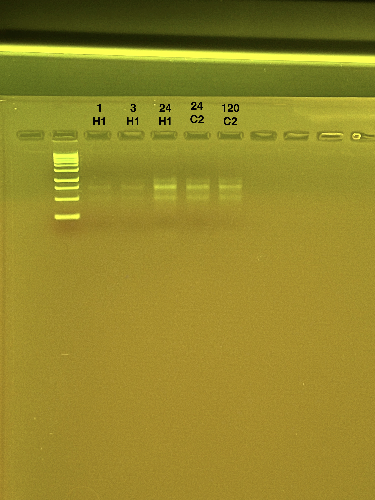

## RNA Re-extractions for Time Series Project, August 29, 2025

### Continuation of Natalie's amazing work extracting these samples, latest post [here](https://github.com/nchampney/NEC_Putnam_Lab_Notebook/blob/master/_posts/2025-08-14-TimeSeries-RNA-Re-Extractions.md)

### [Protocol Link](https://github.com/zdellaert/ZD_Putnam_Lab_Notebook/blob/master/protocols/2022-10-03-Protocols_Zymo_Quick_DNA_RNA_Miniprep_Plus.md)

### Re-extraction of 5 *Montipora capitata* samples from the Time Series experiment done in June and July of 2025. These samples did not yield enough RNA to be measured by HS RNA Qubit so re-extraction was needed. 

### I made several adjustments to the protocol to try to maximize yield and minimize mucus carryover.

### Samples

The sample IDs are MON 1 H1, MON 3 H1, MON 24 H1, MON 24 C2, and MON 120 C2.

## Notes

- For sample prep bead beat was used in the original tube and vortexed for an additional 1 minute. 
- Took 2X volume out of the DNA/RNA shield tube to double biomass input into extraction (especially because the shield in these tubes has been refilled, so much of the tissue was already lysed into DNA/RNA shield that had been removed in previous extractions)
- 600 uL of new DNA/RNA shield was added to sample tubes after the 600 uL was taken out for extraction for storage. 
- Adjusted protocol for 2X volume accordingly: added 60 uL ProK digestion buffer and 30 uL ProK
- Performed a heated proteinase K digestion after adding the above and inverting 3X.
  - Digested at 55 ºC on the thermomixer, at 300 rpm, for 10 minutes
- Then spun down to pellet debris for 10 minutes at 9,000 rcf, at 4 ºC
- Then moved supernatant to new tube and added equal volume DNA/RNA lysis buffer. This had to be run through the DNA column in two separate additions of 700 uL
- Flow through from each spin was kept and moved into a new 1.5 mL tube
- To each of those flow-through tubes, 700 uL ethanol was added (worked one tube at a time) and mixed thoroughly (pipette up and down 10 times)
- Then 700 uL of this mixture was added to the RNA column and spun
- Then repeated with the remaining 700 uL in that tube
- Then did the process again for the second 1.5 mL tube of flow through
- Rest of extraction performed as written (except changes below)
- Eluted RNA to 80 uL of RNAse/DNAse free water warmed to 37 ºC (2 additions of 40 uL)
  - After the second elution, the entire eluate was reapplied to the column to get out any last RNA
  - DNA was not extracted
- 2 uL were used for Qubit and 8 uL were used for gel

## Qubit Results

- Used Broad range dsDNA and RNA Qubit Protocol [HERE](https://zdellaert.github.io/ZD_Putnam_Lab_Notebook/Qubit-Protocol/) 
- All samples read twice, standard only read once

HS RNA Standards: 49.50 (S1) and 1038.22 (S2)

| colony_id | Species                    | RNA_QBIT_1 | RNA_QBIT_2 | RNA_QBIT_AVG |
|-----------|----------------------------|------------|------------|--------------|
| 1 H1     | *Montipora capitata*       |    3.76  |  3.83 |   3.795     |
| 3 H1     | *Montipora capitata*       |  3. 38 |  3.4   | 3.39  |
| 24 H1    | *Montipora capitata*       |   14.8  | 14.8 | 14.8       |
| 24 C2    | *Montipora capitata*       |   10.1    | 10.7    | 10.4   |
| 120 C2    | *Montipora capitata*       |   12.9    | 12.9     |   12.9      |

- RNA samples in -80 freezer

## DNA and RNA Quality Check gel

Ran at 60 volts for 60 minutes

